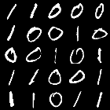
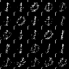
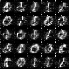

# Evolutionary Optimization for Hybrid Quantum Image Generation GAN

**Keywords**: Quantum Machine Learning; Generative Adversarial Networks; Evolutionary Algorithm; Ansatz Search; 
Hybrid Quantum-Classical System; Quantum GAN.

## Description
This repository contains the code for the EWGAN-GP model, developed as part of the thesis project _Evolutionary Optimization for Hybrid Quantum Image Generation
GAN_, submitted in partial fulfillment of the requirements for the degree of Master of Science of Data Science for
Decision Making at the Department of Advanced Computing Sciences of Maastricht University.

<a href="https://biancamass.github.io/MasterThesis/massaccibianca_master_thesis.pdf" target="_blank"> Click here to read the complete thesis</a>.


### Abstract
This work investigates the effectiveness of a quantum mutation-based evolutionary search  strategy for identifying
better-performing ansatze, evaluated based on image quality and the number of required parameters.
The ansatze are used as generators in a hybrid quantum-classical GAN for generating 28 × 28 grayscale MNIST images of 
digits 0 and 1. The results highlight the feasibility of using architectures that differ from the standard, 
hardware-efficient ansatz to generate images of comparable quality to the current state-of-the-art, and the 
evolutionary algorithm’s potential in discovering superior configurations.

## Example Output

Below a plot of original data and generated images with various models:

a) Original 0 and 1 digit images from the MNIST datasets.

b) Images generated with a fully classical model.

c) Images generated with the EWGAN-GP (the model in this repository).

d) Images generated with State of the Art [PQWGAN](https://www.researchgate.net/publication/366528143_Hybrid_Quantum-Classical_Generative_Adversarial_Network_for_High_Resolution_Image_Generation) model.


<table>
  <tr>
    <td style="text-align:center;">
      <br>
      <em>a)</em>
    </td>
    <td style="text-align:center;">
      <br>
      <em>b)</em>
    </td>
    <td style="text-align:center;">
      <br>
      <em>c)</em>
    </td>
    <td style="text-align:center;">
      <br>
      <em>d)</em>
    </td>
  </tr>
</table>


## Requirements

- **Python Version:** 3.10

#### Libraries
- `numpy==1.23.5`
- `pandas==2.2.2`
- `matplotlib==3.8.4`
- `scipy==1.13.0`
- `tensorflow==2.16.1`
- `torch==2.2.2`
- `seaborn==0.13.2`

#### Installation

It is recommended to use a virtual environment for managing dependencies. To set up and activate a virtual environment:
```
python -m venv ewgan_venv
source ewgan_venv/bin/activate  # On Windows use `ewgan_venv\Scripts\activate`
```

To install the required libraries, run:
```
pip install -r requirements.txt
```

## Usage

### Configuration


## Sources

The main source for how to structure a GAN and WGAN, including architecture structuring, and 
gradient penalty function, was taken from [Erik Linder-Norén's](https://github.com/eriklindernoren) GitHub repo of
PyTorch implementations of Generative Adversarial Networks: [PyTorch-GAN](https://github.com/eriklindernoren/PyTorch-GAN), licensed under MIT license. 

**Insert link to License file**

- Idea for patch: patch paper
- 


Note: I assume square images
Note: I assume each patch has width = image_width

Note: patch width is assumed  to be 28 (width of the whole image)
This choice is based on finding of the PQWGAN paper, where they observed that
horizontal patches worked well for the structure.


