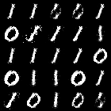

# Evolutionary Optimization for Hybrid Quantum Image Generation GAN

**Keywords**: Quantum Machine Learning; Generative Adversarial Networks; Evolutionary Algorithm; Ansatz Search; 
Hybrid Quantum-Classical System; Quantum GAN.

## Description
This repository contains the code for the EWGAN-GP model, developed as part of the thesis project _Evolutionary Optimization for Hybrid Quantum Image Generation
GAN_, submitted in partial fulfillment of the requirements for the degree of Master of Science of Data Science for
Decision Making at the Department of Advanced Computing Sciences of Maastricht University.

<a href="https://biancamass.github.io/MasterThesis/massaccibianca_master_thesis.pdf" target="_blank"> Click here to read the complete thesis</a>.


### Abstract
This work investigates the effectiveness of a quantum mutation-based evolutionary search  strategy for identifying
better-performing ansatze, evaluated based on image quality and the number of required parameters.
The ansatze are used as generators in a hybrid quantum-classical GAN for generating 28 × 28 grayscale MNIST images of 
digits 0 and 1. The results highlight the feasibility of using architectures that differ from the standard, 
hardware-efficient ansatz to generate images of comparable quality to the current state-of-the-art, and the 
evolutionary algorithm’s potential in discovering superior configurations.

## Example Output

Below a plot of original data and generated images with various models:

a) Original 0 and 1 digit images from the MNIST datasets.

b) Images generated with a fully classical model.

c) Images generated with the EWGAN-GP (the model in this repository).

d) Images generated with State of the Art [PQWGAN](https://www.researchgate.net/publication/366528143_Hybrid_Quantum-Classical_Generative_Adversarial_Network_for_High_Resolution_Image_Generation) model.


<table>
  <tr>
    <td style="text-align:center;">
      <br>
      <em>a)</em>
    </td>
    <td style="text-align:center;">
      <br>
      <em>b)</em>
    </td>
    <td style="text-align:center;">
      <br>
      <em>c)</em>
    </td>
    <td style="text-align:center;">
      <br>
      <em>d)</em>
    </td>
  </tr>
</table>


## Usage

### Requirements

- **Python Version:** 3.10

#### Libraries
- `numpy==1.23.5`
- `pandas==2.2.2`
- `matplotlib==3.8.4`
- `scipy==1.13.0`
- `tensorflow==2.16.1`
- `torch==2.2.2`
- `seaborn==0.13.2`

### Installation

It is recommended to use a virtual environment for managing dependencies. To set up and activate a virtual environment:
```
python -m venv ewgan_venv
source ewgan_venv/bin/activate  # On Windows use `ewgan_venv\Scripts\activate`
```

To install the required libraries, run:
```
pip install -r requirements.txt
```

### Assumptions

The code assumes the following:
- Square images.
- Each patch is assumed to have a width equal to the image width.
- Patch width is assumed to be 28 (width of the whole image).

*Note:* This choice is based on findings from the [PQWGAN paper](https://www.researchgate.net/publication/366528143_Hybrid_Quantum-Classical_Generative_Adversarial_Network_for_High_Resolution_Image_Generation), where horizontal patches were observed to work well for the GAN.


### Configuration

To run with the values of the basic experiment (binary MNIST) with default values run the following command
(note: hyperparameters values are automatically set, to edit, refer to the code):\
`python train.py -cl "01" -d "mnist" -p 28 -l 8 -q 7 -b 25 -o "./output/231023_1953" -c 0 -ps 
1 28 `

Where

| Input     | Description                             |
|-----------|-----------------------------------------|
| -cl       | `string`: name of the classes in training set e.g., "01" will be digits 0 and 1 in MNIST |
| -d        | `string`: training dataset (see folder structure) |
| -p        | `int`: number of patches to divide the images for training |
| -l        | `int`: number of layers |
| -q        | `int`: number of qubits (excl. ancilla) |
| -b        | `int`: batch size |
| -o        | `string`: destination dir for output |
| -c        | `bool`: whether to have  checkpoint|
| -rn       | `bool` : if True, draw latent vector from normal distribution. Else, from uniform. |
| -ps       | `int` `int`: shape of the image patch (for QG) |

Note: the output folder will be automatically named as: 
NumberOfClasses_NumberofPatches_NumberOfLayers_BatchSize, according to the provided parameters. 
If specified in the parameters, randn will be added, as well as patch shape.

## Credits and Acknowledgements

The main source for how to structure a GAN and WGAN, including architecture structuring, and 
gradient penalty function, was taken from [Erik Linder-Norén's](https://github.com/eriklindernoren) GitHub repo of
PyTorch implementations of Generative Adversarial Networks: [PyTorch-GAN](https://github.com/eriklindernoren/PyTorch-GAN), licensed under MIT license. 

This work is based on the Patch Quantum Wasserstein GAN (PQWGAN), introduced by Tsang et al. in the paper _Hybrid quantum-classical generative
adversarial network for high resolution image generation_, available [here](https://www.researchgate.net/publication/366528143_Hybrid_Quantum-Classical_Generative_Adversarial_Network_for_High_Resolution_Image_Generation). 

This work builds on the PQWGAN work, by introducing an evolutionary algorithm for ansatz search, aimed at identifying
ansatz architectures tailored to a specific application, in this case generation of digits images, therefore taking a 
step further from the more commonly employed application-agnostic hardware-efficient ansatz.
My thanks go to Vincenzo Lipardi for the valuable ideas, brainstorming sessions, and support during the development and testing of this algorithm,
and to Menica DiBenedetto for her guidance, insights, and ongoing encouragement.


Note: I assume square images
Note: I assume each patch has width = image_width

Note: patch width is assumed  to be 28 (width of the whole image)
This choice is based on finding of the PQWGAN paper, where they observed that
horizontal patches worked well for the structure.


